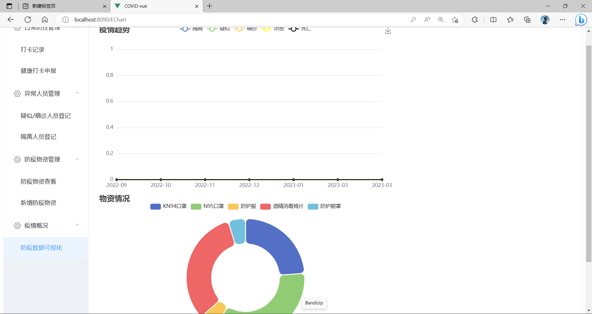
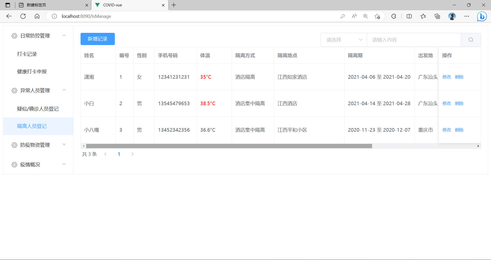
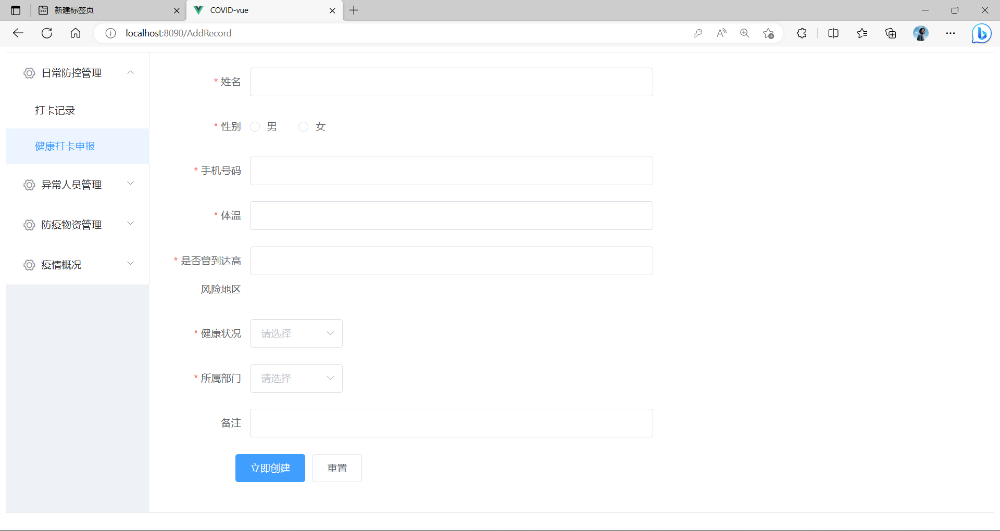
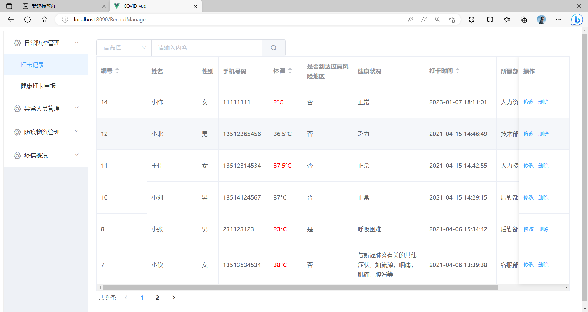
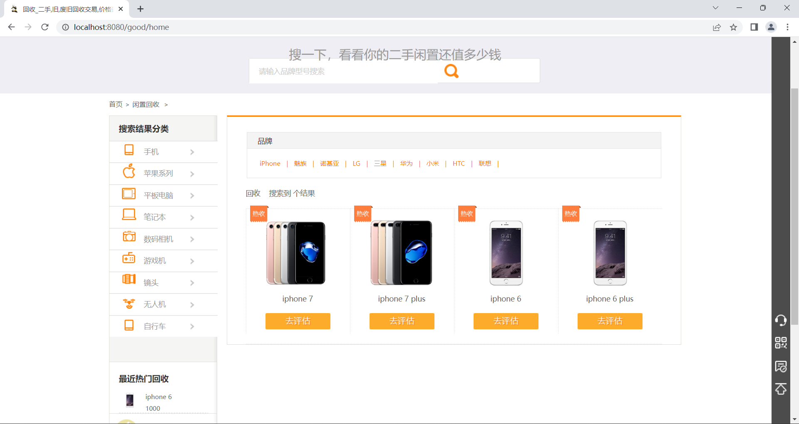
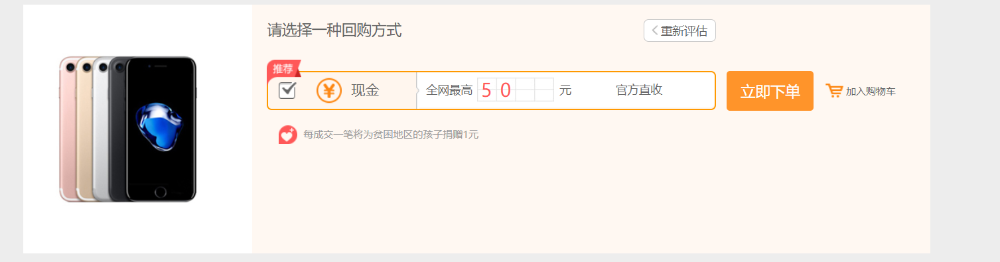
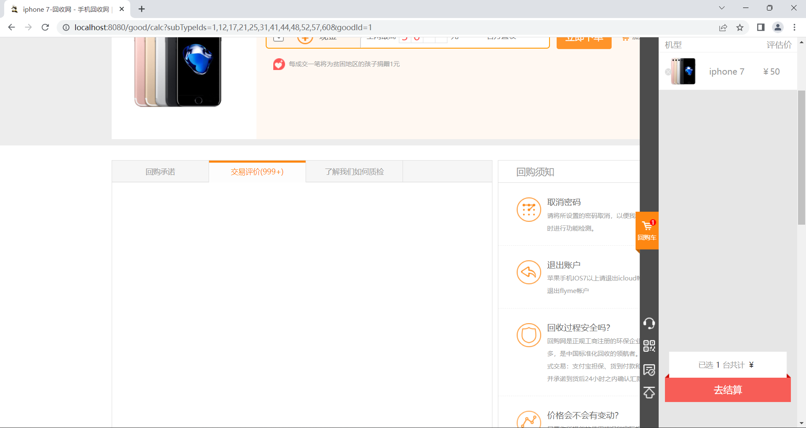

#### 此仓库一共上传了两个项目分别是Epidemic、lehuan

#### **Epidemic:**

基于Spring Boot和Vue的前后端分离的疫情管理系统是一个基于Web的应用程序，旨在帮助用户跟踪和管理疫情信息。该应用程序的后端使用Spring Boot框架构建，它提供了一组用于开发Web应用程序的工具和库。前端使用Vue.js框架开发，它是一种流行的JavaScript框架，用于构建现代Web应用程序。

该应用程序具有以下功能：

疫情数据可视化：用户可以查看实时的疫情数据，包括感染人数、死亡人数、康复人数等，并以图表的形式展示数据。

区域统计：用户可以查看各地区的疫情数据，包括感染人数、死亡人数、康复人数等，并以表格的形式展示数据。

健康打卡：用户可以自行打卡查看有没有去过高风险区域。

疫情物资：用户可以查看疫情防护物资，添加物资 数量。

用户管理：管理员可以管理用户，包括添加、删除、修改用户信息等。

#### lehuan

基于SSM框架和Layui进行开发的二手手机收购平台旨在提供一个方便快捷的手机收购平台，用户可以通过该平台轻松地出售自己的二手手机。该平台具有以下主要功能：

1. 发布商品：用户可以在平台上发布自己的二手手机信息，包括品牌、型号、颜色、外观、功能等详细信息，并设置出售价格和收货地址。

   

2. 手机评估：该平台还提供了手机评估功能，用户可以输入自己的手机信息，平台会根据市场价格、手机新旧程度等因素评估出一个合理的收购价格。

3. 

4. ![QQ图片20230330162704](QQ图片20230330162704.png购物车：用户可以将感兴趣的商品加入购物车，并在一定时间内下单购买。

   

5. 查看手机类型：用户可以浏览平台上的手机类型，并查看各种手机的详细信息和价格，方便用户选择自己心仪的手机。

该平台采用了SSM框架进行开发，Spring作为核心框架提供了依赖注入、AOP等核心特性；MyBatis作为数据访问层框架提供了方便的SQL映射和结果映射；SpringMVC作为控制层框架提供了方便的请求映射和参数绑定。Layui则为前端提供了易于使用和美观的UI框架，同时具有响应式布局，支持PC和移动端设备。该平台的优点在于采用了成熟的开发框架和技术，能够提高开发效率和可维护性，同时提供了丰富的功能和友好的用户界面，能够满足用户的需求。
